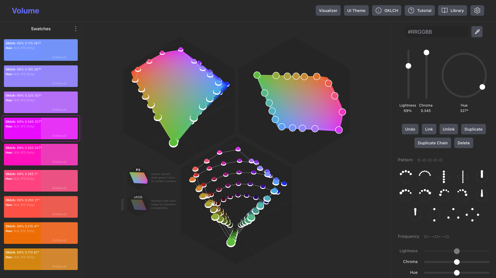

# Volume: The World's Most Powerful Color Palette Generator

# [Launch Volume](https://www.volumecolor.io)

[Report a Bug](https://github.com/loblein/volume/issues) · [Request Feature](https://github.com/loblein/volume/issues)

---

**Volume** is a professional color palette generator for creating perceptually accurate design system palettes. It visualizes the full OKLCH color space in 3D, allowing designers to build, tune, and link **color nodes** (moveable 3D swatches) in a perceptually uniform environment.

Unlike traditional 2D color pickers that hide true color relationships, Volume exposes the geometry of perception, ensuring your palettes remain consistent, accessible, and gamut-safe.

---

## Why Volume?

Designing color palettes in RGB or HSL often feels like guesswork. HSL lightness is inconsistent, gradients turn muddy, and hues shift unpredictably.

Volume solves this by using **OKLCH**, a color model engineered to match how the human eye perceives color.
* **Perceptual Geometry:** Move up for lightness, out for chroma, or rotate for hue. Every step is mathematically consistent.
* **Next-Gen Color Gamuts:** Don't settle for dull legacy colors. Volume lets you choose your target: stick to sRGB for universal compatibility, or switch to Display P3 to unlock the vivid, high-chroma colors that modern screens are capable of—giving you a richer palette than standard tools allow.
* **3D Visualization:** We distribute the workflow across three canvases—a full 3D volume view, an unobstructed node editor, and a top-down slice view—so you can navigate all three axes without getting lost.

---

## Features

### 1. Procedural Node System
Volume works like a vector editor for color. You don't just pick swatches; you place **nodes** in 3D space to build chains.
* **Smart Patterns:** Don't start from scratch. Use predefined node structures to instantly generate linked chains (such as tonal ramps, hue sweeps, or tint scales) with a single click.
* **Linked Nodes:** Connect colors together. If you adjust the Lightness (L) of the parent node, the whole chain moves relative to it.
* **Frequency Control:** Adjust the spacing of nodes in a chain across L, C, and H independently.
* **Modular Editing:** Isolate segments of your palette, tweak them, and snap them back into place while preserving the overall structure.

### 2. Design System Focus
Primary purpose: helping designers create perceptually accurate design system color palettes.
* **Palette Library:** Save and manage your swatch collections in your personal library.
* **Semantic Tokens:** Export your palette as semantic color tokens.
* **Multi-Mode Validation:** Check your colors against different UI themes (Light/Dark modes) instantly.
* **Mockup Visualizer:** Preview your palette applied to real UI components to debug usage.

### 3. Production-Ready Exports
Design in a perceptual space, then ship clean code. Volume exports to:
* **PNG**
* **SVG**
* **CSS Variables**
* **JSON**
* **ASE (Adobe Swatch Exchange)**

---

## The 3 Axes of OKLCH
Volume is built on three perceptual axes:
1.  **L (Lightness):** Runs vertically (0% to 100%). Increasing L genuinely increases perceived brightness across all hues.
2.  **C (Chroma):** Moves outward from the center. Measures intensity/saturation.
3.  **H (Hue):** Rotates around the vertical axis.

---

## Keyboard Shortcuts
Volume is designed for speed. 
| Key | Action |
| :--- | :--- |
| `Cmd + Click (node)` | Link/Unlink |
| `Cmd + Z` | Undo |

---

## Roadmap
We are actively developing Volume. Here is what's coming next:
- [ ] **Figma Plugin:** Direct sync with Figma styles.
- [ ] **Native Mobile Support:** Export tokens for iOS (Swift) and Android (XML/Kotlin).
- [ ] **Team Accounts:** Shared libraries for organizations.
- [ ] **Accessibility:** Real-time contrast checking for both **WCAG 2.1** (AA/AAA) and **APCA** (WCAG 3.0).
- [x] **P3 Gamut Support:** (Recently Added)

---

## Contributing & Support

**Volume is a proprietary tool**, but we manage our issue tracking publicly to stay close to our users.

* **Found a bug?** Please [open an issue](https://github.com/loblein/volume/issues).
* **Have a feature request?** We'd love to hear how to make Volume better for your workflow.

---

© 2026 Volume. All rights reserved. This repository is for documentation and issue tracking only.